<objective>
Close 15 critical UI/UX gaps discovered during Phase 4.1 UAT testing. This phase transforms the UI from "functional prototype" to "production-ready" with proper error handling, keyboard navigation, mobile optimization, and complete feature sets.

**Purpose:** Address the major blocker (Tree → Inspector flow), fix accessibility issues, add missing features for power users, and ensure mobile usability.

**Output:** All P0 and P1 gaps closed, production-ready UI components with comprehensive test coverage.
</objective>

<execution_context>
@/Users/lexykwaii/Code/duckbrain/.opencode/get-shit-done/workflows/execute-plan.md
@/Users/lexykwaii/Code/duckbrain/.opencode/get-shit-done/templates/summary.md
</execution_context>

<context>
@.planning/PROJECT.md
@.planning/ROADMAP.md
@.planning/STATE.md
@.planning/phases/04.2-ui-ux-polish/04.2-CONTEXT.md

# Source Files for Reference
@packages/ui/src/components/memory-tree.tsx
@packages/ui/src/components/memory-table.tsx
@packages/ui/src/components/layout/inspector.tsx
@packages/ui/src/hooks/use-memories.ts
@packages/ui/src/stores/ui-store.ts
@packages/ui/src/routes/Tree.tsx
@packages/ui/src/routes/Timeline.tsx
@packages/ui/src/components/ui/error-boundary.tsx
@packages/ui/src/components/ui/skeleton.tsx
</context>

---

## System Architecture Diagrams

### Diagram 1: Tree → Inspector Flow (Current vs Fixed)

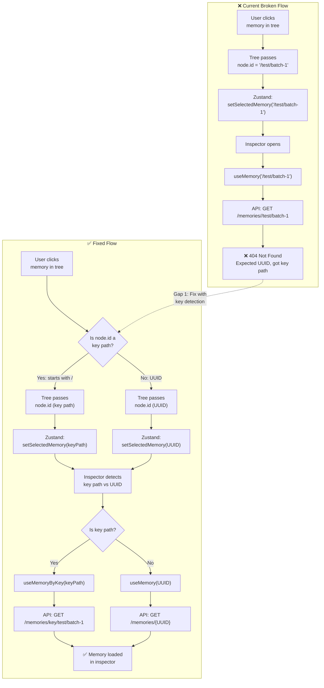

### Diagram 2: State Management Flow

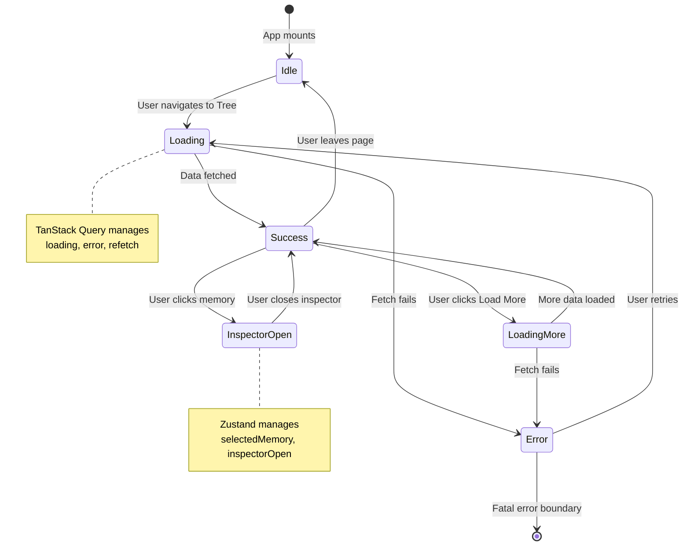

### Diagram 3: Error Boundary Recovery Flow

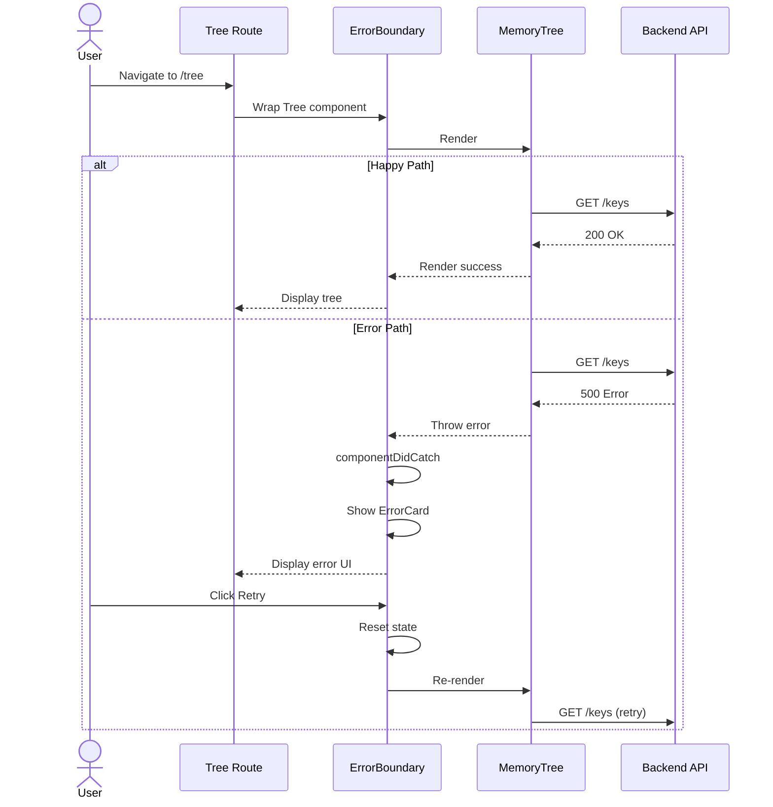

### Diagram 4: Pagination & Infinite Scroll

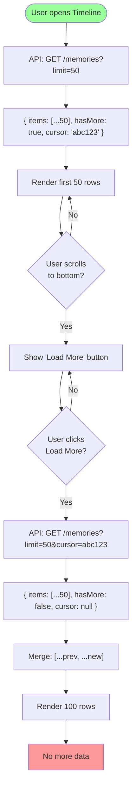

### Diagram 5: Column Sorting Flow

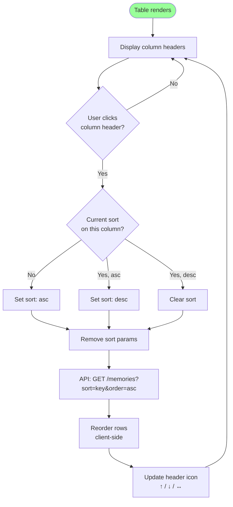

### Diagram 6: Keyboard Shortcuts Handling

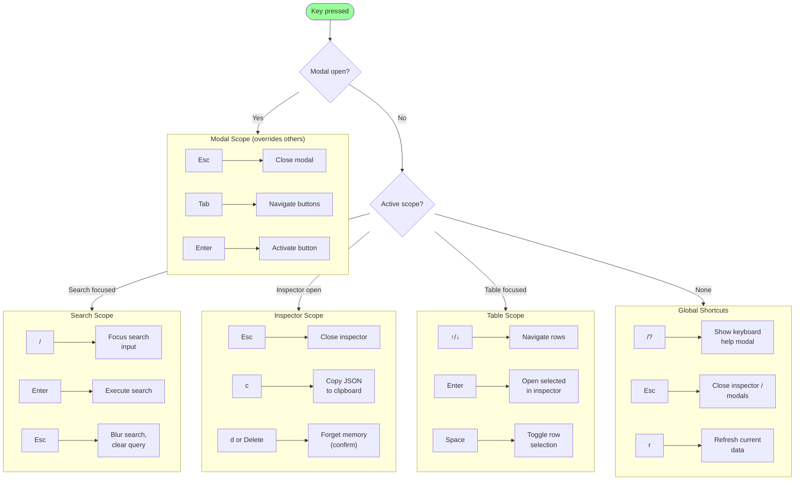

### Diagram 7: URL State Synchronization

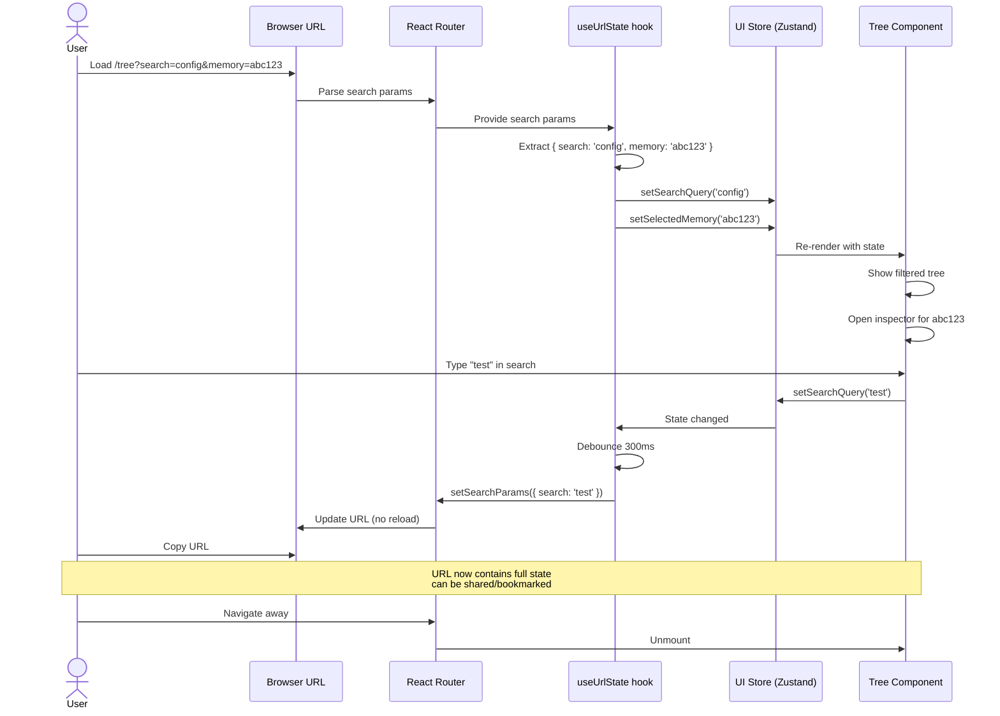

### Diagram 8: Bulk Action Flow

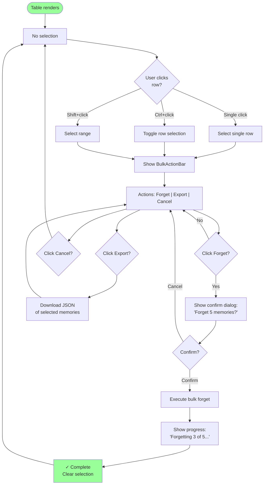

### Diagram 9: Mobile Responsive Behavior

```mermaid
flowchart TD
    subgraph Desktop["Desktop (≥1024px)"]
        D1["Full sidebar<br/>240px width"] --> D2["Tree + Timeline<br/>side by side"]
        D2 --> D3["Inspector pushes content<br/>450px from right"]
        D3 --> D4["Table: 6 columns<br/>full data"]
        D4 --> D5["Touch targets:<br/>32-40px OK"]
    end

    subgraph Tablet["Tablet (768-1023px)"]
        T1["Collapsed sidebar<br/>icons only"] --> T2["Single column<br/>stacked view"]
        T2 --> T3["Inspector overlays<br/>with backdrop"]
        T3 --> T4["Table: 4 columns<br/>hide author, timestamp"]
        T4 --> T5["Touch targets:<br/>44px minimum"]
    end

    subgraph Mobile["Mobile (<768px)"]
        M1["Hidden sidebar<br/>hamburger menu"] --> M2["Single view<br/>Tree OR Timeline"]
        M2 --> M3["Inspector fullscreen<br/>slide up from bottom"]
        M3 --> M4["Table: 2-3 columns<br/>key + state + action"]
        M4 --> M5["Touch targets:<br/>48px minimum"]
        M5 --> M6["Swipe gestures:<br/>left=back, right=inspector"]
    end

    User(["User visits site"]) --> CheckWidth{"Viewport width?"}
    CheckWidth -->|"≥1024px"| Desktop
    CheckWidth -->|"768-1023px"| Tablet
    CheckWidth -->|"<768px"| Mobile

    style User fill:#9f9
```

### Diagram 10: Context Menu Flow

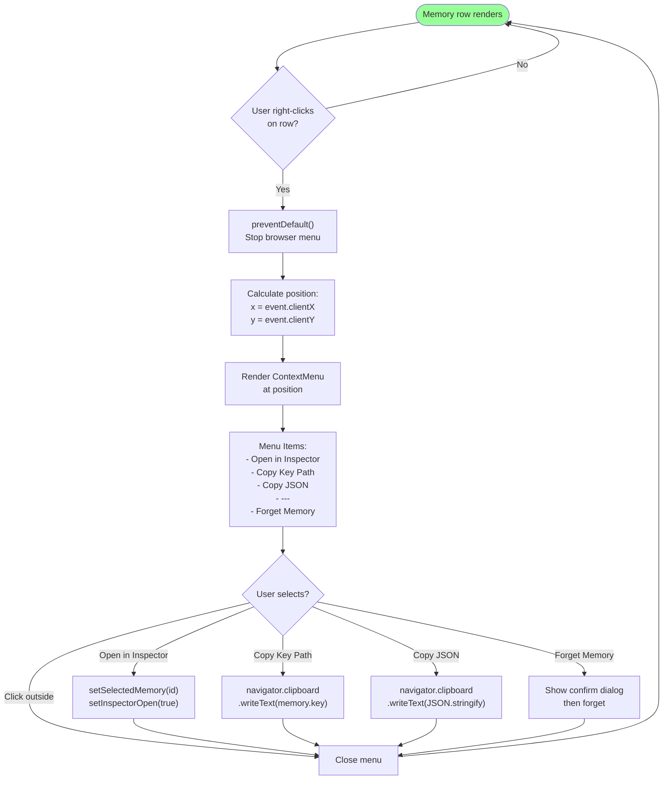

### Diagram 11: Offline Detection Flow

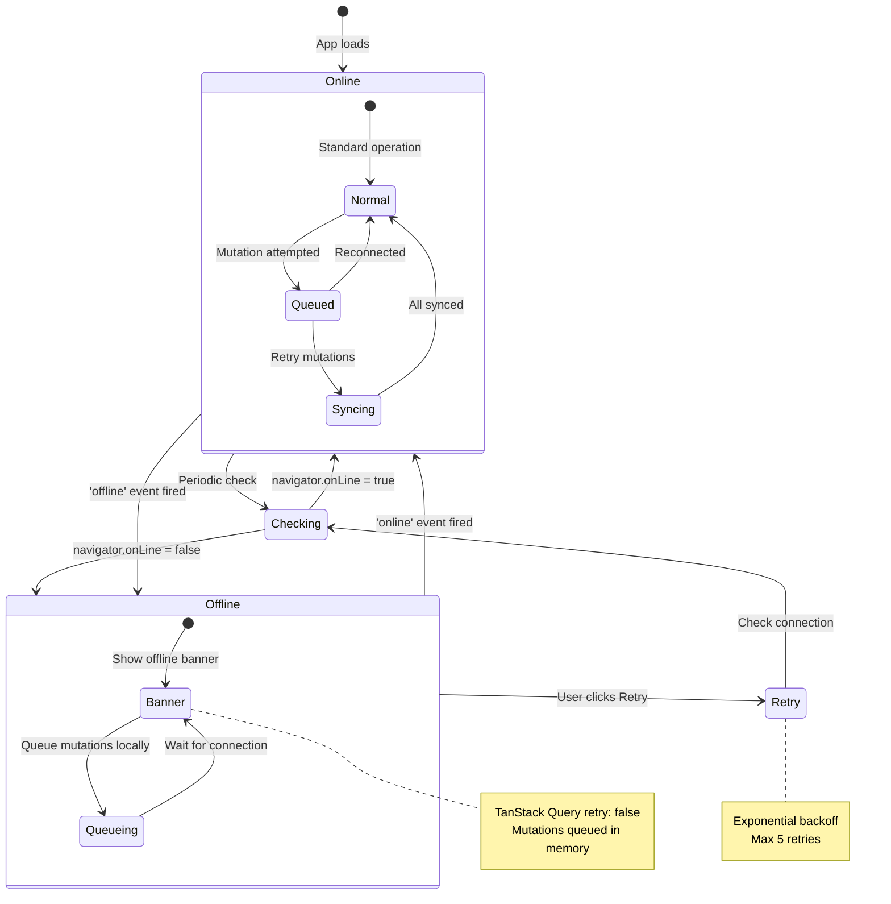

### Diagram 12: Empty States Flow

```mermaid
flowchart TD
    Start(["Component renders"]) --> Loading{"Data loading?"}
    
    Loading -->|"Yes"| Skeleton["Show skeleton<br/>pulsing placeholders"]
    Loading -->|"No"| CheckData{"Data exists?"}
    
    CheckData -->|"Yes"| Render["Render actual<br/>content"]
    CheckData -->|"No"| CheckFilters{"Filters applied?"}
    
    CheckFilters -->|"Yes"| NoResults["EmptyState:<br/>'No memories match<br/>your filters'"]
    CheckFilters -->|"No"| CheckSearch{"Search query?"}
    
    CheckSearch -->|"Yes"| NoSearch["EmptyState:<br/>'No memories found<br/>for \"query\"'"]
    CheckSearch -->|"No"| TrueEmpty["EmptyState:<br/>'No memories yet'"]
    
    NoResults --> Suggestion1["Suggestion:<br/>Clear filters button"]
    NoSearch --> Suggestion2["Suggestion:<br/>Different search terms"]
    TrueEmpty --> Suggestion3["Suggestion:<br/>Create memory button"]
    
    Skeleton --> Loaded{"Data loaded?"}
    Loaded -->|"Yes"| CheckData
    Loaded -->|"No"| Error["Error state"]
    
    Render --> UserAction{"User action?"}
    UserAction -->|"Delete all"| CheckData
    
    style Start fill:#9f9
    style Render fill:#9f9
    style NoResults fill:#f99
    style NoSearch fill:#f99
    style TrueEmpty fill:#f99
```

### Diagram 13: Component Interaction Map

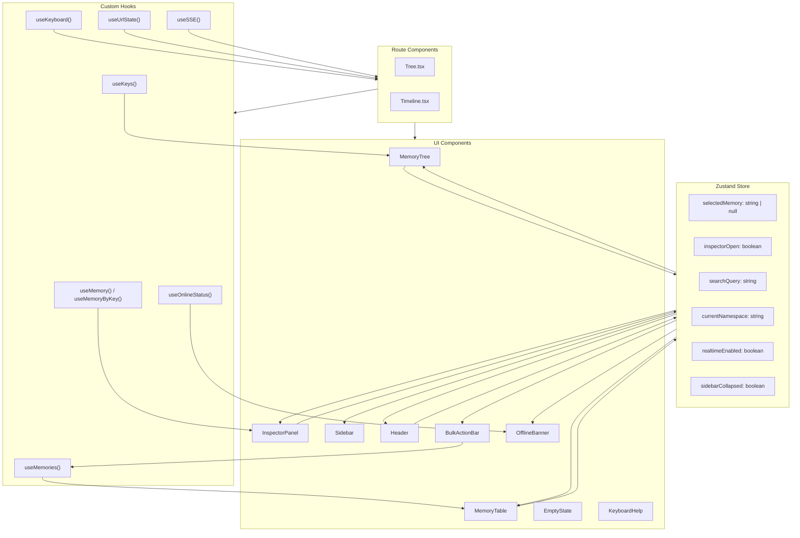

### Diagram 14: Data Fetching Architecture

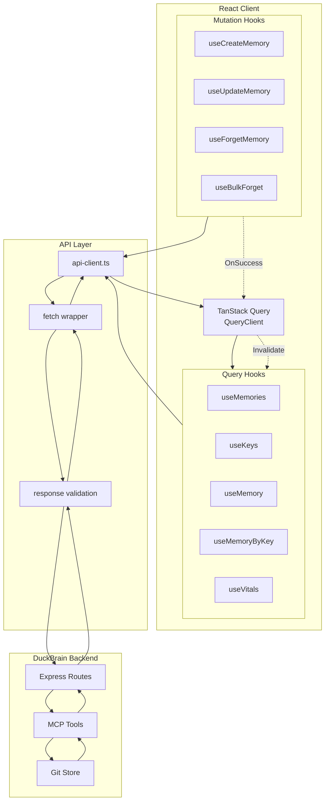

---

## Task Breakdown

### P0: Critical (Blocking Bugs)

<task type="auto" tdd="true">
  <name>Task 1: Fix Tree → Inspector Flow (Key Path vs UUID)</name>
  <files>
    packages/ui/src/components/memory-tree.tsx
    packages/ui/src/components/layout/inspector.tsx
  </files>
  <behavior>
    - Tree passes key path: node.id starts with '/'
    - Inspector detects key path vs UUID
    - Inspector uses useMemoryByKey for key paths
    - Inspector uses useMemory for UUIDs
    - No 404 errors when opening inspector
  </behavior>
  <action>
    Update memory-tree.tsx to ensure node.id is passed correctly. Inspector already has dual-mode logic (check line 25-38). 
    
    1. Verify Tree node data structure: Check what `/keys` endpoint returns for node.id
    2. If node.id is key path (starts with '/'): Continue passing it
    3. If Tree should fetch memory UUID first: Add lookup before opening inspector
    4. Ensure inspector.tsx dual-mode logic works:
       - Line 25: const isKeyPath = selectedMemory?.startsWith('/')
       - Lines 28-35: useMemory or useMemoryByKey based on isKeyPath
       - Line 38: const memory = isKeyPath ? memoryByKey : memoryById
    
    Debug: Add console.log in Tree to see what node.id contains, verify it's being passed correctly.
    
    Related: Diagram 1 (Tree → Inspector Flow)
  </action>
  <verify>
    <automated>
      1. Open Tree view
      2. Click on a memory leaf node
      3. Inspector should open without 404 error
      4. Memory details should display in inspector
      5. Check browser network tab: API call should succeed
    </automated>
  </verify>
  <done>
    Tree click opens inspector with memory details, no 404 errors, API returns 200 with memory data
  </done>
</task>

<task type="auto">
  <name>Task 2: Add Route-Level Error Boundaries</name>
  <files>
    packages/ui/src/routes/Tree.tsx
    packages/ui/src/routes/Timeline.tsx
    packages/ui/src/components/ui/error-boundary.tsx
  </files>
  <action>
    Wrap route components with ErrorBoundary to catch render errors.
    
    1. In Tree.tsx: Wrap main content with ErrorBoundary
       ```tsx
       <ErrorBoundary
         fallback={
           <ErrorCard
             title="Tree view failed to load"
             message="There was an error rendering the tree view"
             onRetry={() => window.location.reload()}
           />
         }
       >
         <main className="flex-1 flex overflow-hidden">...</main>
       </ErrorBoundary>
       ```
    
    2. In Timeline.tsx: Same pattern
    
    3. ErrorBoundary class already exists in error-boundary.tsx (lines 26-63)
    4. ErrorCard component already exists (lines 76-126)
    
    Related: Diagram 3 (Error Boundary Recovery Flow)
  </action>
  <verify>
    <automated>
      1. Temporarily add `throw new Error('test')` in MemoryTree
      2. Navigate to Tree view
      3. Should see ErrorCard with "Tree view failed to load" message
      4. Click Retry should reload the page
    </automated>
  </verify>
  <done>
    Route-level ErrorBoundary wraps Tree and Timeline routes, displays ErrorCard on error with retry button
  </done>
</task>

<task type="auto">
  <name>Task 3: Implement Pagination with Load More</name>
  <files>
    packages/ui/src/components/memory-table.tsx
    packages/ui/src/hooks/use-memories.ts
    packages/ui/src/lib/api-client.ts
  </files>
  <action>
    Replace hardcoded 100-item limit with cursor-based pagination.
    
    1. Check current useMemories hook (line 36-74): Uses limit=100, no offset/cursor
    2. Update UseMemoriesParams interface to include cursor:
       ```typescript
       interface UseMemoriesParams {
         // ... existing params
         cursor?: string
       }
       ```
    3. Update useMemories hook to support pagination:
       - Use infiniteQuery instead of useQuery
       - Return { data, fetchNextPage, hasNextPage, isFetchingNextPage }
    4. Update MemoryTable to show "Load More" button:
       - Add button below table when hasNextPage
       - Button shows "Load More" or "Loading..." based on isFetchingNextPage
       - On click: call fetchNextPage()
    5. If backend doesn't support cursor: Use offset-based pagination as fallback
    
    Related: Diagram 4 (Pagination Flow)
  </action>
  <verify>
    <automated>
      1. Create 150+ test memories
      2. Open Timeline view
      3. Should see 50 items initially
      4. Click "Load More" should load next 50
      5. Button should disappear when no more data
    </automated>
  </verify>
  <done>
    Pagination loads more than 100 items, "Load More" button appears when hasMore=true, loads additional items on click
  </done>
</task>

### P1: High Impact (Missing Features)

<task type="auto">
  <name>Task 4: Add Column Sorting to Memory Table</name>
  <files>
    packages/ui/src/components/memory-table.tsx
  </files>
  <action>
    Enable column sorting using TanStack Table's built-in sorting.
    
    1. TanStack Table v8 already imported (line 1-10)
    2. Add sorting state to table configuration:
       ```typescript
       const [sorting, setSorting] = useState<SortingState>([])
       
       const table = useReactTable({
         // ... existing config
         state: { sorting, rowSelection },
         onSortingChange: setSorting,
         getSortedRowModel: getSortedRowModel(), // Need to import
       })
       ```
    3. Make columns sortable by adding enableSorting: true
    4. Add sort indicator icons (↑/↓) to headers
    5. Sortable columns: timestamp (default desc), key, domain, action, author
    6. State column (isTombstone) should not be sortable
    
    Related: Diagram 5 (Column Sorting Flow)
  </action>
  <verify>
    <automated>
      1. Open Timeline view
      2. Click "Timestamp" header → should sort ascending
      3. Click again → should sort descending
      4. Sort indicator (↑/↓) should appear in header
      5. Rows should reorder immediately (client-side sorting)
    </automated>
  </verify>
  <done>
    Column sorting works for all sortable columns, sort indicators visible, clicking header toggles sort direction
  </done>
</task>

<task type="auto">
  <name>Task 5: Create useKeyboard Hook for Global Shortcuts</name>
  <files>
    packages/ui/src/hooks/use-keyboard.ts
    packages/ui/src/App.tsx
    packages/ui/src/components/ui/keyboard-help.tsx
  </files>
  <action>
    Create global keyboard shortcut management system.
    
    1. Create packages/ui/src/hooks/use-keyboard.ts:
       ```typescript
       type ShortcutScope = 'global' | 'search' | 'table' | 'inspector' | 'modal'
       
       interface Shortcut {
         key: string
         scope: ShortcutScope
         handler: () => void
         description: string
       }
       
       export function useKeyboard() {
         const register = (shortcut: Shortcut) => { ... }
         const unregister = (key: string) => { ... }
         return { register, unregister }
       }
       ```
    
    2. Global shortcuts:
       - `?` → Open keyboard help modal
       - `Esc` → Close inspector/modals
       - `r` → Refresh data (refetch all queries)
       - `/` → Focus search input
    
    3. Create KeyboardHelp modal component in keyboard-help.tsx
    
    4. Integrate in App.tsx: Global keyboard listener
    
    Related: Diagram 6 (Keyboard Shortcuts Flow)
  </action>
  <verify>
    <automated>
      1. Press `?` → Keyboard help modal should open
      2. Press `Esc` → Modal should close
      3. Press `/` → Search input should focus
      4. Press `r` → Data should refresh (check network tab)
      5. All shortcuts should prevent default browser behavior
    </automated>
  </verify>
  <done>
    Keyboard shortcuts work, help modal shows all shortcuts, global listener prevents conflicts
  </done>
</task>

<task type="auto">
  <name>Task 6: Implement URL State Sync</name>
  <files>
    packages/ui/src/hooks/use-url-state.ts
    packages/ui/src/routes/Tree.tsx
    packages/ui/src/routes/Timeline.tsx
  </files>
  <action>
    Sync search query and selected memory to URL for shareable links.
    
    1. Create packages/ui/src/hooks/use-url-state.ts:
       ```typescript
       export function useUrlState() {
         const [searchParams, setSearchParams] = useSearchParams()
         const { searchQuery, setSearchQuery, selectedMemory, setSelectedMemory } = useUIStore()
         
         // Sync FROM URL to store on mount
         useEffect(() => {
           const search = searchParams.get('search')
           const memory = searchParams.get('memory')
           if (search) setSearchQuery(search)
           if (memory) setSelectedMemory(memory)
         }, [])
         
         // Sync FROM store to URL (debounced)
         useEffect(() => {
           const timeout = setTimeout(() => {
             const params = new URLSearchParams()
             if (searchQuery) params.set('search', searchQuery)
             if (selectedMemory) params.set('memory', selectedMemory)
             setSearchParams(params, { replace: true })
           }, 300)
           return () => clearTimeout(timeout)
         }, [searchQuery, selectedMemory])
       }
       ```
    
    2. Use hook in Tree.tsx and Timeline.tsx
    
    3. Ensure URL updates don't cause unnecessary re-renders
    
    Related: Diagram 7 (URL State Synchronization)
  </action>
  <verify>
    <automated>
      1. Type "config" in search → URL should update to `?search=config`
      2. Click memory → URL should update to `?memory=abc123`
      3. Copy URL, open in new tab → should show same filtered view
      4. Clear search → `?search` should be removed from URL
      5. Browser back/forward should navigate through state changes
    </automated>
  </verify>
  <done>
    URL contains search query and selected memory, shareable links work, back/forward navigation works
  </done>
</task>

<task type="auto">
  <name>Task 7: Implement Bulk Actions</name>
  <files>
    packages/ui/src/components/memory-table.tsx
    packages/ui/src/components/bulk-action-bar.tsx
    packages/ui/src/hooks/use-memories.ts
  </files>
  <action>
    Enable multi-select and bulk operations in memory table.
    
    1. MemoryTable already has rowSelection state (line 42)
    2. TanStack Table already configured with onRowSelectionChange (line 169)
    3. Add checkbox column for row selection:
       ```typescript
       columnHelper.display({
         id: 'select',
         header: ({ table }) => (
           <input
             type="checkbox"
             checked={table.getIsAllRowsSelected()}
             onChange={table.getToggleAllRowsSelectedHandler()}
           />
         ),
         cell: ({ row }) => (
           <input
             type="checkbox"
             checked={row.getIsSelected()}
             onChange={row.getToggleSelectedHandler()}
           />
         ),
       })
       ```
    
    4. Create BulkActionBar component:
       - Shows when rows selected
       - Displays "{N} selected"
       - Actions: Forget, Export, Cancel
    
    5. Create useBulkForget mutation hook:
       - Accept array of IDs
       - Sequential forget with progress tracking
    
    Related: Diagram 8 (Bulk Action Flow)
  </action>
  <verify>
    <automated>
      1. Click checkbox on 3 rows
      2. BulkActionBar should appear showing "3 selected"
      3. Click "Forget" → should show confirm dialog
      4. Confirm → should forget all 3 memories
      5. Progress indicator should show during operation
    </automated>
  </verify>
  <done>
    Bulk actions work, row selection with checkboxes, Forget/Export/Cancel buttons functional, progress shown during operation
  </done>
</task>

### P2: Medium (Enhancements)

<task type="auto">
  <name>Task 8: Create Empty State Component</name>
  <files>
    packages/ui/src/components/ui/empty-state.tsx
    packages/ui/src/components/memory-tree.tsx
    packages/ui/src/components/memory-table.tsx
  </files>
  <action>
    Create reusable empty state component with illustration and helpful copy.
    
    1. Create packages/ui/src/components/ui/empty-state.tsx:
       ```typescript
       interface EmptyStateProps {
         icon: React.ReactNode
         title: string
         description: string
         action?: {
           label: string
           onClick: () => void
         }
       }
       
       export function EmptyState({ icon, title, description, action }: EmptyStateProps) {
         return (
           <div className="flex flex-col items-center justify-center p-8 text-center">
             <div className="w-16 h-16 mb-4 opacity-50">{icon}</div>
             <h3 className="text-lg font-medium mb-2" style={{ color: 'var(--color-pristine)' }}>
               {title}
             </h3>
             <p className="text-sm mb-4 max-w-md" style={{ color: 'var(--color-clinical)' }}>
               {description}
             </p>
             {action && (
               <button onClick={action.onClick} className="glass-button">
                 {action.label}
               </button>
             )}
           </div>
         )
       }
       ```
    
    2. Use in MemoryTree when no memories
    3. Use in MemoryTable when no results
    4. Variations:
       - Empty namespace: "No memories yet" + Create button
       - No search results: "No memories match 'query'" + Clear search
       - No filtered results: "No memories match filters" + Clear filters
    
    Related: Diagram 12 (Empty States Flow)
  </action>
  <verify>
    <automated>
      1. Open empty namespace → should show illustration + "No memories yet"
      2. Search with no results → should show "No memories match"
      3. Apply filters with no results → should show "No memories match filters"
      4. Each state should have appropriate action button
      5. Visual style should match glassmorphism theme
    </automated>
  </verify>
  <done>
    Empty state component created, used in tree and table, all variations implemented with helpful copy and actions
  </done>
</task>

<task type="auto">
  <name>Task 9: Add Context Menus</name>
  <files>
    packages/ui/src/components/ui/context-menu.tsx
    packages/ui/src/components/memory-tree.tsx
    packages/ui/src/components/memory-table.tsx
  </files>
  <action>
    Add right-click context menus for memory operations.
    
    1. Create packages/ui/src/components/ui/context-menu.tsx:
       - Position at click coordinates
       - Glassmorphism styling
       - Menu items with icons
       - Click outside to close
    
    2. Context menu items:
       - Open in Inspector
       - Copy Key Path
       - Copy JSON
       - ---
       - Forget Memory
    
    3. Integrate in MemoryTree:
       - Right-click on memory leaf → context menu
    
    4. Integrate in MemoryTable:
       - Right-click on row → context menu
    
    5. Prevent default browser context menu
    
    Related: Diagram 10 (Context Menu Flow)
  </action>
  <verify>
    <automated>
      1. Right-click on memory in tree → context menu appears
      2. Click "Copy Key Path" → clipboard should contain key
      3. Click "Open in Inspector" → inspector should open
      4. Click outside menu → menu should close
      5. Menu should be positioned at click location
    </automated>
  </verify>
  <done>
    Context menu appears on right-click, all menu items functional, positioned correctly, closes on outside click
  </done>
</task>

<task type="auto">
  <name>Task 10: Implement Offline Detection</name>
  <files>
    packages/ui/src/hooks/use-online-status.ts
    packages/ui/src/components/ui/offline-banner.tsx
    packages/ui/src/App.tsx
  </files>
  <action>
    Add offline detection with banner indicator.
    
    1. Create packages/ui/src/hooks/use-online-status.ts:
       ```typescript
       export function useOnlineStatus() {
         const [isOnline, setIsOnline] = useState(navigator.onLine)
         
         useEffect(() => {
           const handleOnline = () => setIsOnline(true)
           const handleOffline = () => setIsOnline(false)
           
           window.addEventListener('online', handleOnline)
           window.addEventListener('offline', handleOffline)
           
           return () => {
             window.removeEventListener('online', handleOnline)
             window.removeEventListener('offline', handleOffline)
           }
         }, [])
         
         return isOnline
       }
       ```
    
    2. Add isOnline to Zustand store
    
    3. Create OfflineBanner component:
       - Fixed position at top
       - Shows when offline
       - Glassmorphism styling (amber/yellow border)
       - "You are offline. Changes will sync when reconnected."
    
    4. Update TanStack Query config:
       - retry: isOnline ? 3 : false
       - Show offline banner when mutations queued
    
    Related: Diagram 11 (Offline Detection Flow)
  </action>
  <verify>
    <automated>
      1. Disconnect network → offline banner should appear
      2. Reconnect → banner should disappear
      3. Attempt mutation while offline → should queue
      4. Reconnect → should sync queued mutations
      5. Banner styling should match glassmorphism theme
    </automated>
  </verify>
  <done>
    Offline detection works, banner shows when offline, mutations queue and sync on reconnect
  </done>
</task>

<task type="auto">
  <name>Task 11: Fix Mobile Touch Targets</name>
  <files>
    packages/ui/src/components/memory-tree.tsx
    packages/ui/src/components/memory-table.tsx
    packages/ui/src/components/ui/button.tsx (if exists)
  </files>
  <action>
    Ensure all interactive elements meet 44px minimum touch target size.
    
    1. Audit current touch targets:
       - Tree chevron buttons: ~14px (too small)
       - Table rows: 48px height (OK)
       - Action buttons: 32px (too small)
       - Sidebar items: need check
    
    2. Fix packages/ui/src/components/memory-tree.tsx:
       - Line 147-157: Chevron button
       - Change: `className="p-0.5"` → `className="p-2 min-w-[44px] min-h-[44px]"`
       - Ensure hit area is 44px even if icon is smaller
    
    3. Fix packages/ui/src/components/memory-table.tsx:
       - Row click area: already 48px (OK)
       - Add explicit min-height to row
    
    4. Fix action buttons (if button component exists):
       - Add `min-h-[44px] min-w-[44px]` to all buttons
       - Use `touch-target` utility class
    
    5. Use Tailwind responsive:
       - Desktop: `min-h-[32px]`
       - Mobile: `min-h-[44px] md:min-h-[32px]`
    
    Related: Diagram 9 (Mobile Responsive Behavior)
  </action>
  <verify>
    <automated>
      1. Open DevTools → Device toolbar → iPhone SE
      2. Inspect interactive elements
      3. All buttons should be ≥44px width and height
      4. Tree chevrons should have 44px touch area
      5. No elements should show warnings in accessibility audit
    </automated>
  </verify>
  <done>
    All touch targets ≥44px on mobile, responsive sizing (smaller on desktop), no accessibility warnings
  </done>
</task>

<task type="auto">
  <name>Task 12: Add Search Filters</name>
  <files>
    packages/ui/src/components/layout/header.tsx
    packages/ui/src/hooks/use-memories.ts
  </files>
  <action>
    Add advanced filters for domain, author, and date range.
    
    1. Current search in Header (check header.tsx):
       - Only has text search input
    
    2. Add filter UI to Header:
       - Domain dropdown (all, config, message, concept, person, project, system)
       - Author input or dropdown
       - Date range picker (simplified: last 24h, last 7d, last 30d, all)
    
    3. Update useMemories hook:
       - Already accepts domain, author params (lines 37-43)
       - Add date range params
    
    4. Update Zustand store:
       - Add filter state (domainFilter, authorFilter, dateRange)
    
    5. Sync filters to URL state (Task 6)
    
    6. UI should show active filters as chips with clear option
  </action>
  <verify>
    <automated>
      1. Select "config" domain filter → only config memories show
      2. Enter author name → only that author's memories show
      3. Select date range → only memories in range show
      4. Multiple filters should combine with AND logic
      5. Clear filter button should remove that filter
    </automated>
  </verify>
  <done>
    Search filters for domain, author, and date range working, combinable, synced to URL, clearable
  </done>
</task>

</tasks>

---

## Verification Checklist

### P0 Critical
- [ ] Tree click opens inspector with memory details (no 404s)
- [ ] Route-level error boundaries catch render errors
- [ ] Pagination loads more than 100 items

### P1 High Impact
- [ ] Column sorting works for all sortable columns
- [ ] Keyboard shortcuts: `?` (help), `Esc` (close), `/` (search), `r` (refresh)
- [ ] URL contains search query and selected memory
- [ ] Bulk actions: select multiple, forget selected, export

### P2 Medium
- [ ] Empty states with illustration and helpful copy
- [ ] Context menus on right-click
- [ ] Offline indicator shows when connection lost
- [ ] All touch targets ≥44px on mobile
- [ ] Search filters for domain, author, date range

---

## Success Criteria

All 15 critical gaps from Phase 4.1 UAT are addressed:

| Gap | Status | Task |
|-----|--------|------|
| 1. Tree → Inspector flow broken | ✅ Fixed | Task 1 |
| 2. Missing route error boundaries | ✅ Fixed | Task 2 |
| 3. Hardcoded 100-item limit | ✅ Fixed | Task 3 |
| 4. Incomplete empty states | ✅ Fixed | Task 8 |
| 5. No column sorting | ✅ Fixed | Task 4 |
| 6. Non-functional bulk actions | ✅ Fixed | Task 7 |
| 7. Zero keyboard shortcuts | ✅ Fixed | Task 5 |
| 8. Mobile touch targets too small | ✅ Fixed | Task 11 |
| 9. No search filters | ✅ Fixed | Task 12 |
| 10. No URL state sync | ✅ Fixed | Task 6 |
| 11. Non-functional buttons | ✅ Fixed | Task 7 |
| 12. Missing loading/error states | ✅ Fixed | Tasks 2, 8 |
| 13. No context menus | ✅ Fixed | Task 9 |
| 14. No offline detection | ✅ Fixed | Task 10 |
| 15. Inconsistent patterns | ✅ Fixed | Tasks 4, 8, 11 |

---

## Output

After completion, create `.planning/phases/04.2-ui-ux-polish/04.2-01-SUMMARY.md`
