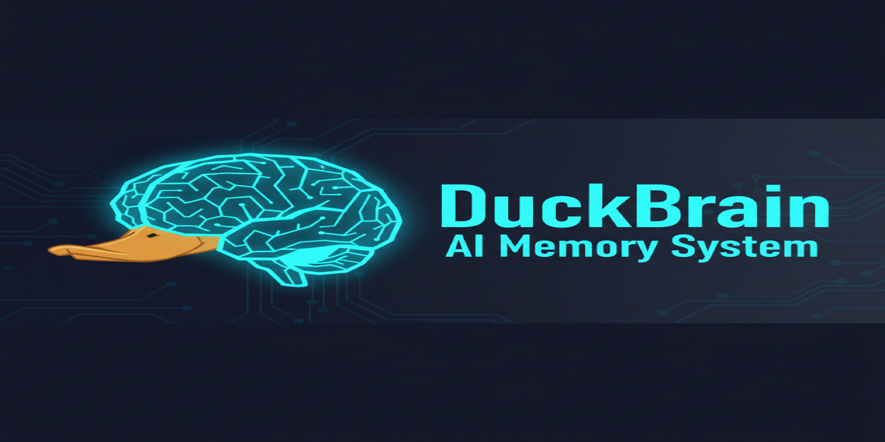

# DuckBrain 🧠🦆

[](https://github.com/wojons/duckbrain)
[](LICENSE)
[](https://www.typescriptlang.org/)
[](https://duckdb.org/)

> A distributed, event-sourced, version-controlled memory system for AI agents. Built on DuckDB + Git.



## What is DuckBrain?

DuckBrain provides AI agents with **persistent, queryable, version-controlled memory** — without running a traditional database. Memories are stored as append-only JSONL files, queried via DuckDB (including vector search), and fully versioned by Git.

**Core Value:** Agents can remember and learn across sessions with full history, zero-cost branching, and collaborative sharing — all without database operations.

## Features

- 🧠 **Hierarchical Memory Keys** — Filesystem-style paths (`/projects/mcp/schema`)
- 🔍 **Vector Search** — Built-in similarity search with DuckDB VSS
- 🌳 **Git Version Control** — Full audit trail, branching, time-travel
- 🚀 **Multiple Interfaces** — MCP server, HTTP API, CLI, Web UI
- 👥 **Multi-Agent Ready** — HTTP mode with worktrees for concurrent access
- 🎨 **Beautiful Web UI** — Glassmorphism theme, real-time updates
- 📱 **Keyboard Shortcuts** — Power-user friendly navigation

## Quick Start

### Installation

```bash
# Clone the repository
git clone https://github.com/wojons/duckbrain.git
cd duckbrain

# Install dependencies
npm install

# Start the development server
npm run dev
```

### Running DuckBrain

**MCP Server Mode (for Claude/Cursor):**
```bash
npm start -- stdio
```

**HTTP Server Mode:**
```bash
npm start -- http --port=3000
```

**Web UI Only:**
```bash
cd packages/ui
npm run dev
```

## Screenshots

### Memory Tree View


### Timeline View


### Keyboard Shortcuts


## Architecture

```
┌─────────────────┐     ┌─────────────────┐     ┌─────────────────┐
│   MCP Client    │     │   HTTP Client   │     │   Web Browser   │
└────────┬────────┘     └────────┬────────┘     └────────┬────────┘
         │                       │                       │
         └───────────────────────┼───────────────────────┘
                                 │
                    ┌─────────────▼─────────────┐
                    │      DuckBrain Core       │
                    │  ┌─────────────────────┐  │
                    │  │   MCP Tools         │  │
                    │  │   - remember()      │  │
                    │  │   - recall()        │  │
                    │  │   - forget()        │  │
                    │  │   - list_keys()     │  │
                    │  └─────────────────────┘  │
                    └─────────────┬─────────────┘
                                  │
                    ┌─────────────▼─────────────┐
                    │      Storage Layer        │
                    │  ┌─────────────────────┐  │
                    │  │   JSONL Files     │  │
                    │  │   Manifest Index  │  │
                    │  │   Git Versioning  │  │
                    │  └─────────────────────┘  │
                    └─────────────┬─────────────┘
                                  │
                    ┌─────────────▼─────────────┐
                    │      Query Engine         │
                    │  ┌─────────────────────┐  │
                    │  │   DuckDB + VSS      │  │
                    │  │   Vector Search     │  │
                    │  │   Full-text Search  │  │
                    │  └─────────────────────┘  │
                    └───────────────────────────┘
```

## MCP Tools

DuckBrain exposes these MCP tools:

- **`remember`** — Store a memory with key, domain, and content
- **`recall`** — Query memories by key, domain, or semantic similarity
- **`list_keys`** — List available memory keys (guardrail against hallucinations)
- **`forget`** — Mark a memory as tombstoned

## Requirements

- Node.js 20+
- Git
- DuckDB (bundled)

## Documentation

Full documentation is available at:

- 📖 [Getting Started Guide](docs/guide/getting-started.md)
- 🔧 [API Reference](docs/api/mcp-tools.md)
- 🏗️ [Architecture](.planning/PROJECT.md)

## Contributing

Contributions welcome! Please read [CONTRIBUTING.md](CONTRIBUTING.md) for details.

## License

DuckBrain uses **Split Licensing** to protect the project while remaining open source:

### Code: Apache License 2.0

All source code in this repository is licensed under the **Apache License 2.0** — a permissive license with explicit patent protection.

```
Copyright 2025 DuckBrain Contributors

Licensed under the Apache License, Version 2.0 (the "License");
you may not use this file except in compliance with the License.
You may obtain a copy of the License at

    http://www.apache.org/licenses/LICENSE-2.0

Unless required by applicable law or agreed to in writing, software
distributed under the License is distributed on an "AS IS" BASIS,
WITHOUT WARRANTIES OR CONDITIONS OF ANY KIND, either express or implied.
See the License for the specific language governing permissions and
limitations under the License.
```

**Why Apache 2.0?**
- ✅ Permissive — use in commercial and private projects
- ✅ Patent protection — includes explicit patent grant
- ✅ Compatible with GPLv3 — can be combined
- ✅ Industry standard — used by Kubernetes, TensorFlow, Android

### Brand Assets: CC BY-NC-ND 4.0

The brand assets (logo, mascot, banners) in `/assets/brand/` are **excluded** from the Apache 2.0 license.

They are licensed under **Creative Commons Attribution-NonCommercial-NoDerivatives 4.0 International**:

- ✅ **Attribution (BY)** — You must give credit to DuckBrain
- ✅ **NonCommercial (NC)** — You may not use commercially
- ✅ **NoDerivatives (ND)** — You may not modify or create derivatives

**What this means:**
- You CAN view and download assets as part of the repository
- You CAN refer to DuckBrain in documentation and tutorials
- You CANNOT use the logo for your own projects without permission
- You CANNOT sell merchandise with the DuckBrain logo
- You CANNOT create modified versions of the mascot

See [`assets/brand/LICENSE-ASSETS.md`](assets/brand/LICENSE-ASSETS.md) for full details.

### Trademarks

"DuckBrain" and the DuckBrain logo are trademarks of the DuckBrain project. See [`TRADEMARK_POLICY.md`](TRADEMARK_POLICY.md) for usage guidelines.

### ⚠️ Experimental Licensing — Feedback Requested

We're currently evaluating our licensing strategy and would love your input!

**Open questions:**
- Is CC BY-NC-ND too restrictive for community use?
- Should we provide explicit fair-use guidelines for tutorials?
- Would a "Community Assets" license be beneficial for forks?

**Share your thoughts:**
- Open an issue with label `licensing`
- Start a discussion on GitHub Discussions

Your feedback will directly shape our licensing approach.

## Acknowledgments

Built with:
- [DuckDB](https://duckdb.org/) — The fast in-process analytical database
- [MCP SDK](https://github.com/modelcontextprotocol/typescript-sdk) — Model Context Protocol
- [TanStack](https://tanstack.com/) — Query, Table, Virtual — Modern React data tooling
- [Zustand](https://github.com/pmndrs/zustand) — Small, fast state management
- [Vite](https://vitejs.dev/) — Next generation frontend tooling

---

<p align="center">
  
  <br>
  <em>"Remember everything, forget nothing."</em>
</p>
