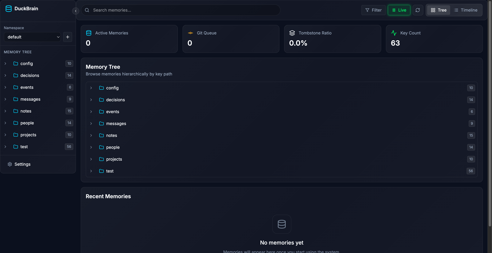
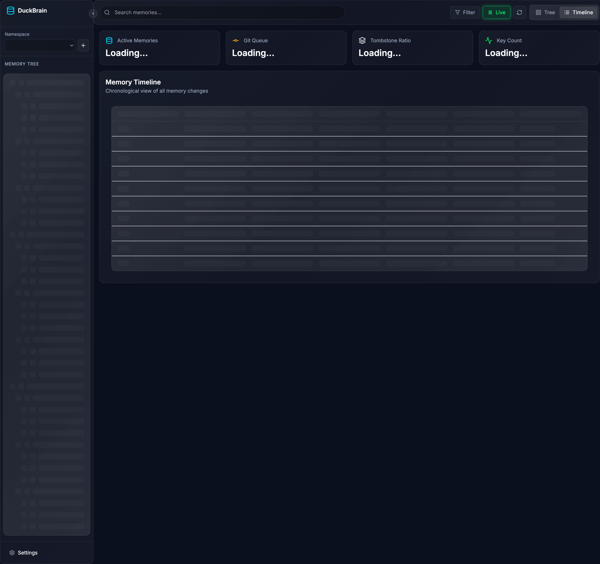
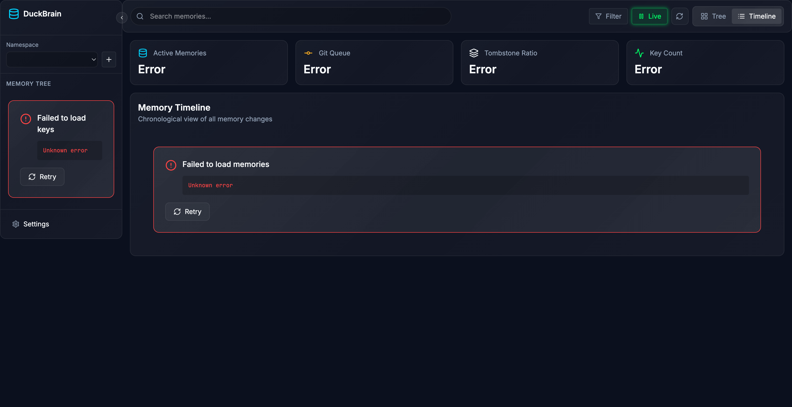

# DuckBrain 🧠🦆

[](https://github.com/wojons/duckbrain)
[](LICENSE)
[](https://www.typescriptlang.org/)
[](https://duckdb.org/)

> A distributed, event-sourced, version-controlled memory system for AI agents. Built on DuckDB + Git.


## What is DuckBrain?

DuckBrain provides AI agents with **persistent, queryable, version-controlled memory** — without running a traditional database. Memories are stored as append-only JSONL files, queried via DuckDB (including vector search), and fully versioned by Git.

**Core Value:** Agents can remember and learn across sessions with full history, zero-cost branching, and collaborative sharing — all without database operations.

## Features

- 🧠 **Hierarchical Memory Keys** — Filesystem-style paths (`/projects/mcp/schema`)
- 🔍 **Vector Search** — Built-in similarity search with DuckDB VSS
- 🌳 **Git Version Control** — Full audit trail, branching, time-travel
- 🚀 **Multiple Interfaces** — MCP server, HTTP API, CLI, Web UI
- 👥 **Multi-Agent Ready** — HTTP mode with worktrees for concurrent access
- 🎨 **Beautiful Web UI** — Glassmorphism theme, real-time updates
- 📱 **Keyboard Shortcuts** — Power-user friendly navigation

## Quick Start

### Installation

```bash
# Clone the repository
git clone https://github.com/wojons/duckbrain.git
cd duckbrain

# Install dependencies
npm install

# Start the development server
npm run dev
```

### Running DuckBrain

**MCP Server Mode (for Claude/Cursor):**
```bash
npm start -- stdio
```

**HTTP Server Mode:**
```bash
npm start -- http --port=3000
```

**Web UI Only:**
```bash
cd packages/ui
npm run dev
```

## Screenshots

### Memory Tree View


### Timeline View


### Keyboard Shortcuts


## Architecture

```
┌─────────────────┐     ┌─────────────────┐     ┌─────────────────┐
│   MCP Client    │     │   HTTP Client   │     │   Web Browser   │
└────────┬────────┘     └────────┬────────┘     └────────┬────────┘
         │                       │                       │
         └───────────────────────┼───────────────────────┘
                                 │
                    ┌─────────────▼─────────────┐
                    │      DuckBrain Core       │
                    │  ┌─────────────────────┐  │
                    │  │   MCP Tools         │  │
                    │  │   - remember()      │  │
                    │  │   - recall()        │  │
                    │  │   - forget()        │  │
                    │  │   - list_keys()     │  │
                    │  └─────────────────────┘  │
                    └─────────────┬─────────────┘
                                  │
                    ┌─────────────▼─────────────┐
                    │      Storage Layer        │
                    │  ┌─────────────────────┐  │
                    │  │   JSONL Files     │  │
                    │  │   Manifest Index  │  │
                    │  │   Git Versioning  │  │
                    │  └─────────────────────┘  │
                    └─────────────┬─────────────┘
                                  │
                    ┌─────────────▼─────────────┐
                    │      Query Engine         │
                    │  ┌─────────────────────┐  │
                    │  │   DuckDB + VSS      │  │
                    │  │   Vector Search     │  │
                    │  │   Full-text Search  │  │
                    │  └─────────────────────┘  │
                    └───────────────────────────┘
```

## MCP Tools

DuckBrain exposes these MCP tools:

- **`remember`** — Store a memory with key, domain, and content
- **`recall`** — Query memories by key, domain, or semantic similarity
- **`list_keys`** — List available memory keys (guardrail against hallucinations)
- **`forget`** — Mark a memory as tombstoned

## Requirements

- Node.js 20+
- Git
- DuckDB (bundled)

## Documentation

Full documentation is available at:

- 📖 [Getting Started Guide](docs/guide/getting-started.md)
- 🔧 [API Reference](docs/api/mcp-tools.md)
- 🏗️ [Architecture](.planning/PROJECT.md)

## Contributing

Contributions welcome! Please read [CONTRIBUTING.md](CONTRIBUTING.md) for details.

## License

ISC License — see [LICENSE](LICENSE) for details.

## Acknowledgments

Built with:
- [DuckDB](https://duckdb.org/) — The fast in-process analytical database
- [MCP SDK](https://github.com/modelcontextprotocol/typescript-sdk) — Model Context Protocol
- [TanStack](https://tanstack.com/) — Query, Table, Virtual — Modern React data tooling
- [Zustand](https://github.com/pmndrs/zustand) — Small, fast state management
- [Vite](https://vitejs.dev/) — Next generation frontend tooling

---

<p align="center">
  
  <br>
  <em>"Remember everything, forget nothing."</em>
</p>
