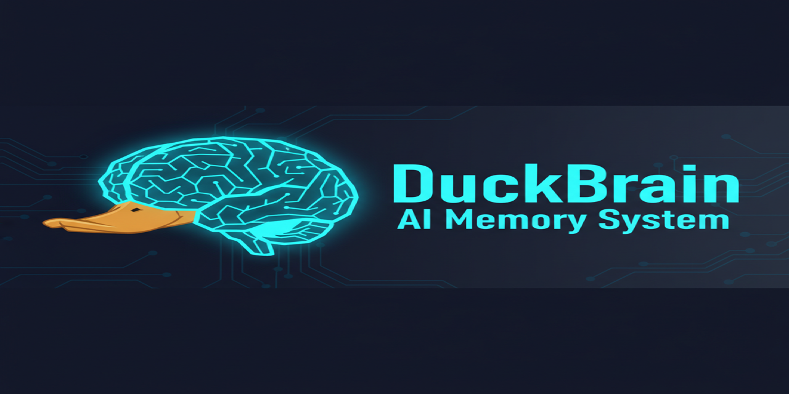
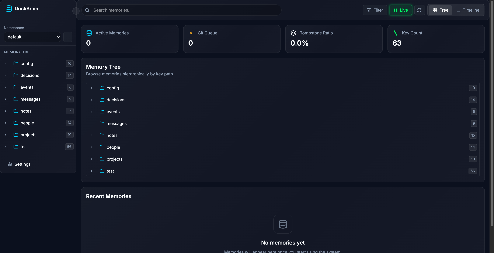
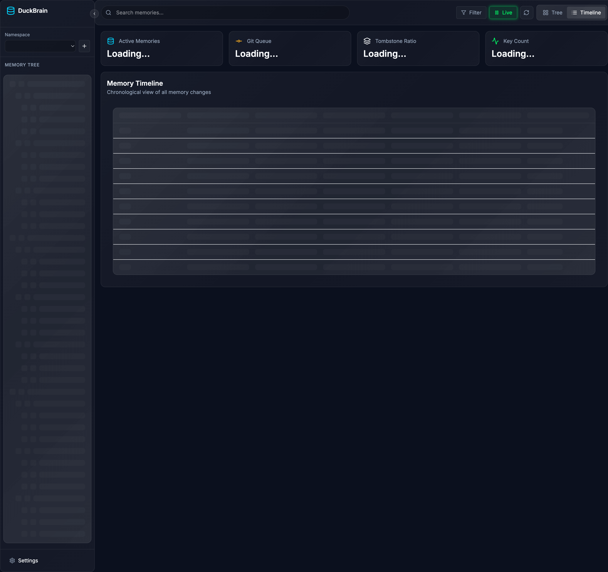
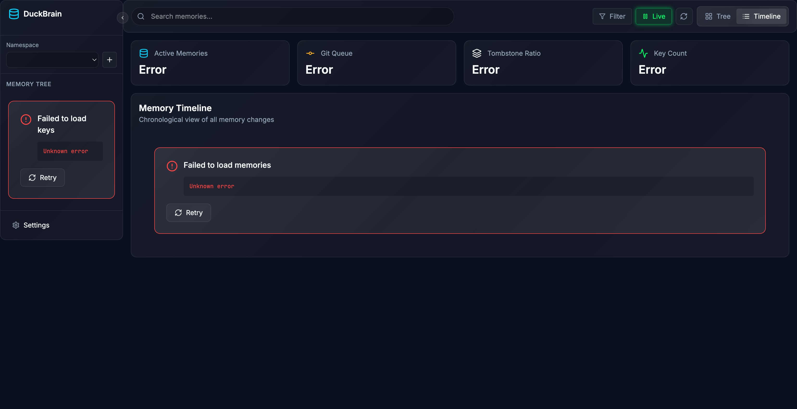

# DuckBrain 🧠🦆

[](https://github.com/wojons/duckbrain)
[](LICENSE)
[](https://www.typescriptlang.org/)
[](https://duckdb.org/)

> A distributed, event-sourced, version-controlled memory system for AI agents. Built on DuckDB + Git.



## What is DuckBrain?

DuckBrain provides AI agents with **persistent, queryable, version-controlled memory** — without running a traditional database. Memories are stored as append-only JSONL files, queried via DuckDB (including vector search), and fully versioned by Git.

**Core Value:** Agents can remember and learn across sessions with full history, zero-cost branching, and collaborative sharing — all without database operations.

## Positioning: A git-native data layer for agent memory

> DuckBrain is a git-native, agent-first memory system built on DuckDB, with MCP and HTTP access and namespace-local history; the “Supabase-for-DuckDB” phrase is a roadmap analogy for additive generic REST, declared-schema, and realtime work, alongside implemented-on-branch role/auth controls that still await public release evidence — not a claim of Supabase compatibility or managed-service parity.

Full positioning — the complete capability matrix, source notes, and as-of walkthrough — lives in **[docs/guide/positioning.md](docs/guide/positioning.md)**. That page is the single owner of the long matrix; this section is the compact version.

### What exists now

| Capability                                                                    | Status                                                         |
| ----------------------------------------------------------------------------- | -------------------------------------------------------------- |
| DuckDB-backed local query/storage runtime (via `node-duckdb`)                 | Available now                                                  |
| Git repository per namespace; namespace files are committed                   | Available now                                                  |
| Read-only as-of recall at a date, commit, branch, or tag — no checkout        | Available now                                                  |
| MCP tools (`remember`, `recall`, `list_keys`, `forget`, `squash`, namespaces) | Available now                                                  |
| HTTP API (`/api/memories`, `/api/keys`, `/api/namespaces`, …)                 | Available now                                                  |
| Optional S3 sync / push-on-commit                                             | Available only where configured (`s3.enabled`, off by default) |

### Why git-native

- **Namespace-local history.** Each namespace is its own git repository: `git init` runs inside the namespace directory and its files are committed (`src/git/autocommit.ts`), so `git log`, `git diff`, `git branch`, and `git tag` work on your memory directly.
- **Time travel without checkout.** `resolveAsOfRef` accepts an ISO-8601 date, commit hash, branch, or tag and reads the namespace's files at that ref (`git show <ref>:<path>`) — read-only, with no worktree mutation (`src/git/asof.ts`; see the [as-of recall walkthrough](docs/guide/positioning.md#git-history-refs-and-what-rollback-means-here)).
- **Inspectable storage.** Memories are append-only JSONL files you can read, copy, and archive while DuckBrain is stopped; DuckDB is the query layer over them, not a locked store.
- **“Rollback” means operator recovery, not an undo API.** An operator can inspect and recover a prior revision through the namespace's git history; there is no undo endpoint, merge UI, or automatic branch lifecycle, and recovery needs that commit to exist locally in the namespace repo.

### Roadmap surface (not available now)

- **Planned:** generic REST over declared tables, with persistent declared schemas (SUPA-3 / SUPA-6).
- **Planned:** committed, resumable SSE change feed (SUPA-5).
- **Implemented on branch — release evidence pending:** role grants, pluggable auth backends, and token lifecycle (DB-SUPA-4). Implemented with named tests, but not “available now” until release evidence is verified.

See [docs/guide/positioning.md](docs/guide/positioning.md) for the full four-status matrix and the evidence bar behind every label.

### What this is not

- Not a clone, drop-in replacement, or API-compatible equivalent of Supabase; no hosted control plane, billing, or managed-service parity.
- Not a PostgREST deployment and not derived from PostgREST code — PostgREST is a REST server for PostgreSQL and does not run on SQLite or DuckDB.
- Not multi-region HA, synchronous replication, or point-in-time recovery: S3 support is an optional, configured sync path, inert unless you enable it.
- Not production-certified: no uptime, latency, or durability claim without a linked measurement.

## Features

- 🧠 **Hierarchical Memory Keys** — Filesystem-style paths (`/projects/mcp/schema`)
- 🔍 **Vector Search** — Built-in similarity search with DuckDB VSS
- 🌳 **Git Version Control** — Full audit trail, branching, time-travel
- 🚀 **Multiple Interfaces** — MCP server, HTTP API, CLI, Web UI
- 👥 **Multi-Agent Ready** — HTTP mode with worktrees for concurrent access
- 🎨 **Beautiful Web UI** — Glassmorphism theme, real-time updates
- 📱 **Keyboard Shortcuts** — Power-user friendly navigation
- ☁️ **Native S3 Storage Tier** — Incremental sync, push-on-commit, SQL over S3 via DuckDB httpfs, multi-host memory

## Quick Start

### Installation

#### Prerequisites

You need **git**, **Node.js 22+**, and **pnpm 12**. The repository pins the tested pnpm release (`12.4.2`) in `package.json`. On a fresh Debian/Ubuntu box that only has git:

```bash
# Node.js 22+ via nvm (~11s on a fresh box), or install from nodejs.org / your distro's packages
curl -o- https://raw.githubusercontent.com/nvm-sh/nvm/v0.40.7/install.sh | bash
. ~/.nvm/nvm.sh   # or open a new shell
nvm install 22 && nvm use 22

# pnpm 12.4.2 via corepack, installed without writing to root-owned /usr/bin
mkdir -p ~/.local/bin
corepack enable pnpm --install-directory ~/.local/bin
export PATH="$HOME/.local/bin:$PATH"
corepack prepare pnpm@12.4.2 --activate
pnpm --version  # expect 12.4.2
```

Add `$HOME/.local/bin` to your shell profile so `pnpm` remains on `PATH` in new shells.

`duckbrain.config.json` is instance-local and untracked — the repo ships `duckbrain.config.example.json` as the template; the defaults work out of the box.

**Fresh-host extras** (labelled by feature, full detail in the [Getting Started Guide](docs/guide/getting-started.md)): a **global git identity** (`git config --global user.name` / `user.email`) is required by the git-backed memory store; the **S3 storage tier** needs `git-remote-s3` + AWS CLI (in a Python venv); the **integration test suite** needs `sshpass`.

```bash
# Clone the repository
git clone https://github.com/wojons/duckbrain.git
cd duckbrain

# Install dependencies
pnpm install

# Start the development server
pnpm run dev
```

### Verify the install

Paste in order; the last command must print the memory you stored:

```bash
# 1. start the HTTP daemon in the background
pnpm start http --port=3000 &

# 2. wait for health (200, or 503 "degraded" while the embedding probe is unmet — that is not an install failure)
curl -s http://127.0.0.1:3000/health

# 3. create a scratch namespace
curl -s -X POST http://127.0.0.1:3000/api/namespaces \
  -H 'Content-Type: application/json' -d '{"name":"quickstart"}'

# 4. write a memory
curl -s -X POST 'http://127.0.0.1:3000/api/memories?namespace=quickstart' \
  -H 'Content-Type: application/json' \
  -d '{"key":"/quickstart/hello","domain":"concept","content":"first memory from the quickstart"}'

# 5. read it back — expect the stored content in the response
curl -s 'http://127.0.0.1:3000/api/memories/key/quickstart/hello?namespace=quickstart'
```

Success looks like: the final read returns a JSON memory object with `"key": "/quickstart/hello"` and `"content": "first memory from the quickstart"`. Connection refused on step 2 means the daemon didn't start — check the background job's output. A fresh daemon has no auth (auth is opt-in via `--auth=apikey`), so these commands need no key. Stop the background daemon with `kill %1` when done.

### Running DuckBrain

**MCP Server Mode (for Claude/Cursor):**

```bash
pnpm start stdio
```

**HTTP Server Mode (MCP-over-HTTP + REST API):**

```bash
pnpm start http --port=3000
```

**HTTP Server Mode with Unix socket** (for MCP-over-HTTP over a permissioned filesystem socket):

```bash
pnpm start http --port=3000 --unix-socket=/tmp/duckbrain.sock --unix-socket-mode=0660 --unix-socket-group=duckbrain
```

The HTTP server listens on TCP (default `127.0.0.1:3000`) and, when `--unix-socket` is given, on a Unix domain socket as well. Socket permissions are applied after bind (`--unix-socket-mode`, default `0660`) and the socket can be chowned to a group with `--unix-socket-group` (name or numeric GID). Stale socket files are removed automatically on startup.

**Web UI Only:**

```bash
cd packages/ui
pnpm run dev
```

### Daily consolidation digest

`duckbrain consolidate` scans one UTC day's JSONL deltas across all namespaces, dedupes repeated content, and prints per-namespace stats and previews plus a digest block. Dry-run by default; `--write-digest` (or `DUCKBRAIN_API_KEY` set) POSTs the digest as a memory in the `duckbrain` namespace (key `/project/duckbrain/digest/<date>`):

```bash
duckbrain consolidate --date=2026-09-19     # read-only: digest to stdout
duckbrain consolidate --write-digest        # requires DUCKBRAIN_API_KEY
```

### Remote Access over SSH

DuckBrain can be reached through an SSH tunnel. Run the dry pre-flight `duckbrain ssh-test --host=<user@server>` first — it opens no connection and prints the exact remote command plus a ready-to-paste Claude Desktop MCP entry; `ssh-connect` then creates the local socket-backed tunnel:

```bash
duckbrain ssh-test --host=user@server        # pre-flight: prints tunnel command + MCP config, exits 0
duckbrain ssh-connect --host=user@server --name=prod
```

See [docs/guide/deployment.md](docs/guide/deployment.md) for the full tunnel flow (socket paths, SSH flags, lifecycle, remote CLI execution).

### Native S3 Storage Tier (opt-in)

DuckBrain can back memory onto any S3-compatible object store (Hetzner Object Storage, MinIO, AWS S3, …) as a first-class storage tier: incremental sync, push-on-commit, SQL over S3 via DuckDB's httpfs extension, and multi-host memory (pull on another machine = DR + shared memory). The module is **inert by default** (`s3.enabled: false`); activate it by setting `s3.enabled: true` in `duckbrain.config.json`:

```json
{
  "s3": {
    "enabled": true,
    "endpoint": "https://s3.<your-region>.your-provider.com",
    "bucket": "my-duckbrain",
    "prefix": "duckbrain",
    "pushOnCommit": true
  }
}
```

Credentials are never stored in config (it's git-tracked) — export them in the daemon/CLI environment: `AWS_PROFILE=<your-profile>` (or `AWS_ACCESS_KEY_ID` / `AWS_SECRET_ACCESS_KEY`). The endpoint resolves **env-first** for `s3 status`/`s3 sync`/`s3 query` — `AWS_ENDPOINT_URL_S3`, then `AWS_ENDPOINT_URL`, then `s3.endpoint` — while the push-on-commit child keeps `s3.endpoint` and only lets `AWS_ENDPOINT_URL_S3` through (`AWS_ENDPOINT_URL` is replaced by the config value); use `AWS_ENDPOINT_URL_S3` when you need one env var to move both. Then:

```bash
duckbrain s3 status          # verify bucket listing works
duckbrain s3 sync all push   # first full push (subsequent pushes are delta-only)
duckbrain s3 query "SELECT count(*) FROM read_json_auto('s3://duckbrain/<ns>/event/2026-08/current.jsonl')"  # SQL over S3
```

Restart the MCP/HTTP daemon after activating so autocommit picks up `pushOnCommit`. See [docs/s3-native.md](docs/s3-native.md) for the full design.

## Screenshots

### Memory Tree View



### Timeline View



### Keyboard Shortcuts



## Architecture

```
┌─────────────────┐     ┌─────────────────┐     ┌─────────────────┐
│   MCP Client    │     │   HTTP Client   │     │   Web Browser   │
└────────┬────────┘     └────────┬────────┘     └────────┬────────┘
         │                       │                       │
         └───────────────────────┼───────────────────────┘
                                 │
                    ┌─────────────▼─────────────┐
                    │      DuckBrain Core       │
                    │  ┌─────────────────────┐  │
                    │  │   MCP Tools         │  │
                    │  │   - remember()      │  │
                    │  │   - recall()        │  │
                    │  │   - forget()        │  │
                    │  │   - list_keys()     │  │
                    │  └─────────────────────┘  │
                    └─────────────┬─────────────┘
                                  │
                    ┌─────────────▼─────────────┐
                    │      Storage Layer        │
                    │  ┌─────────────────────┐  │
                    │  │   JSONL Files     │  │
                    │  │   Manifest Index  │  │
                    │  │   Git Versioning  │  │
                    │  └─────────────────────┘  │
                    └─────────────┬─────────────┘
                                  │
                    ┌─────────────▼─────────────┐
                    │      Query Engine         │
                    │  ┌─────────────────────┐  │
                    │  │   DuckDB + VSS      │  │
                    │  │   Vector Search     │  │
                    │  │   Full-text Search  │  │
                    │  └─────────────────────┘  │
                    └───────────────────────────┘
```

## MCP Tools

DuckBrain exposes these MCP tools (available over stdio and MCP-over-HTTP at `POST /mcp`):

- **`remember`** — Store a memory with key, domain, and content
- **`recall`** — Query memories by key, domain, or semantic similarity
- **`list_keys`** — List available memory keys (guardrail against hallucinations)
- **`forget`** — Mark a memory as tombstoned
- **`squash`** — Compact old memory partitions (JSONL → Parquet, remove tombstones)
- **`get_compaction_stats`** — Report repository compaction health
- **`create_namespace`** / **`list_namespaces`** / **`switch_namespace`** / **`delete_namespace`** — Namespace management (each namespace is its own git repo)
- **`server_status`** — Check whether the HTTP server is listening (TCP port and/or Unix socket), report PID and MCP-over-HTTP endpoints
- **`server_http_start`** — Trigger the HTTP server to start as a detached background process (port, socket, permissions, auth, rate-limit)

## HTTP API

The HTTP server (`pnpm start http`, default `http://127.0.0.1:3000`) also serves a REST API under `/api/` for scripts, dashboards, and non-MCP clients. Core read routes (all verified against a live daemon):

| Route                        | Description                                                                                                                     |
| ---------------------------- | ------------------------------------------------------------------------------------------------------------------------------- |
| `GET /api/keys`              | Hierarchical memory key tree (`?namespace=`, `?prefix=`, `?depth=`)                                                             |
| `GET /api/memories`          | Query memories — filters (`?namespace=`, `?domain=`, `?contains=`), pagination (`?limit=`, `?offset=`), semantic search (`?q=`) |
| `GET /api/memories/key/:key` | Latest memory for a key path (`?namespace=`)                                                                                    |
| `GET /api/memories/:id`      | Single memory by ID (`?namespace=`)                                                                                             |

When the server is started with `--auth=apikey`, clients must send `X-API-Key`; keys are configured in `~/.duckbrain/auth.json`. See [Using API Key Authentication](docs/api/http-api.md#using-api-key-authentication).

```bash
# Key tree
curl -H "X-API-Key: <key>" "http://localhost:3000/api/keys?namespace=default"

# Query memories (keyword filter ?contains= works offline)
curl -H "X-API-Key: <key>" "http://localhost:3000/api/memories?namespace=default&limit=10"

# Semantic search — needs a reachable embedding provider (see note below)
curl -H "X-API-Key: <key>" "http://localhost:3000/api/memories?namespace=default&q=connection+pooling"

# Latest memory for a key path
curl -H "X-API-Key: <key>" "http://localhost:3000/api/memories/key/benchmarks/models/deepseek-v4-pro?namespace=default"

# Single memory by ID
curl -H "X-API-Key: <key>" "http://localhost:3000/api/memories/fda1ce7a-4ec4-487b-ae66-403d04b0c30c?namespace=default"
```

- Namespace-scoped routes default to `default` when `?namespace=` is omitted.
- Semantic search (`?q=`) requires a reachable embedding provider at query time. Verified live: with embeddings down the endpoint fails closed with an explicit message — e.g. `{"error":"Embedding generation failed: ... No models loaded ..."}` — never a silent unfiltered list. On a current build this is **503 `EMBEDDINGS_UNAVAILABLE`**; a daemon started before the DB-GAP-036 fix surfaces the same message with status 500, so restart an old daemon to pick up the 503.
- There is **no `/api/memory` route** — `/api/memory`, `/api/memory/key/...`, and `/api/memory/:id` all return 404 `ROUTE_NOT_FOUND`. The plural `/api/memories` is the correct prefix.

Full endpoint reference (writes, namespaces, SSE events, compaction, auth): [HTTP API Reference](docs/api/http-api.md).

## Embeddings & Semantic Search

DuckBrain supports semantic (`query`) search via a **content-addressed embedding cache**. Design principles (Bane, 2026-08-02):

- **Embeddings are NEVER stored in git.** Vectors live in a per-namespace cache dir (`.embeddings/`, auto-gitignored) keyed by `sha256(modelId + contentHash)`. They're derivable artifacts, not source of truth — cloning a namespace gives you the JSONL memories, and the cache rebuilds locally.
- **Model-agnostic.** Each model gets its own cache namespace (`lmstudio/qwen3`, `ollama/nomic`, …). Different people can use different embedding models on the same repo without corrupting each other.
- **Cache-assisted rebuild.** `duckbrain embeddings rebuild` hashes every unique `embedding_text`, embeds only cache misses, and skips hits. Unchanged content rebuilds instantly; new content or a model switch means a slower cold rebuild ("old ones can take a while").
- **Git hooks.** `duckbrain embeddings install-hooks` installs `post-checkout` / `post-merge` / `post-rewrite` hooks that fire a **detached** rebuild after clone/pull — git operations never block on embedding.

**Providers** (config `embedding.provider` or `DUCKBRAIN_EMBEDDING_PROVIDER`): `lmstudio` (default, OpenAI-compatible), `ollama`, `openai`, or `auto` (probe in order). Model via `embedding.model` / `DUCKBRAIN_EMBEDDING_MODEL`; base URL via `embedding.baseUrl` / `DUCKBRAIN_EMBEDDING_BASE_URL`; API key via `DUCKBRAIN_EMBEDDING_API_KEY`; dimensions via `DUCKBRAIN_EMBEDDING_DIMENSIONS` (default 384).

```bash
duckbrain embeddings status                          # cache stats, models, hooks
duckbrain embeddings rebuild --namespace=my-ns       # cache-assisted rebuild
duckbrain embeddings rebuild --force                 # re-embed everything
duckbrain embeddings install-hooks --namespace=my-ns # hooks → detached rebuild on clone/pull
duckbrain embeddings providers                       # list providers + env overrides
```

Semantic search (`recall` with `query`) ranks candidates by cosine similarity using cached vectors, embedding cache misses on the fly (capped) so a cold clone still works.

**Prerequisites & failure behavior.** Semantic (`?q=`) search needs a reachable embedding provider at query time: LM Studio or Ollama with a loaded embedding model, or `DUCKBRAIN_EMBEDDING_API_KEY` for the `openai` provider. Check `GET /health` first — its `embedding` block reports `healthy` plus per-provider `providers[]` entries (`id`/`healthy`/`note`). When no provider can embed, semantic endpoints return **HTTP 503 `EMBEDDINGS_UNAVAILABLE`** with an explicit message telling you to start LM Studio/Ollama or set `DUCKBRAIN_EMBEDDING_PROVIDER` and run `duckbrain embeddings rebuild` — never a silent unfiltered list. Keyword search (`?contains=`) remains available offline. A reachable provider is not necessarily a usable one (`/models` can answer 200 while every embed 401s/timeouts): run `pnpm ops:embedding-preflight` to prove the path end to end — it exits 1 (fail closed) on that asymmetric state and never prints the key. See the [preflight & provider diagnosis runbook](docs/guide/embeddings.md#preflight--provider-diagnosis-ops-004).

## Requirements

- Node.js 22+
- Git
- DuckDB (bundled)

## Documentation

Full documentation is available at:

- 📖 [Getting Started Guide](docs/guide/getting-started.md)
- 📐 [Positioning & Roadmap](docs/guide/positioning.md) — what exists now, what is planned, what this is not
- 🔧 [MCP Tools API Reference](docs/api/mcp-tools.md)
- 🌐 [HTTP API Reference](docs/api/http-api.md)
- 🤖 [AI-Agent Integration Guide](docs/guide/ai-configure.md)
- 🧠 [Embeddings & Semantic Search](docs/guide/embeddings.md)
- ☁️ [Native S3 Storage Tier](docs/s3-native.md)
- 🎓 [DuckBrain Usage Skill](skills/duckbrain-usage/SKILL.md)
- 🏗️ [Architecture](.planning/PROJECT.md)

## Contributing

Contributions welcome! Please read [CONTRIBUTING.md](CONTRIBUTING.md) for details.

## License

DuckBrain uses **Split Licensing** to protect the project while remaining open source:

### Code: Apache License 2.0

All source code in this repository is licensed under the **Apache License 2.0** — a permissive license with explicit patent protection.

```
Copyright 2025 DuckBrain Contributors

Licensed under the Apache License, Version 2.0 (the "License");
you may not use this file except in compliance with the License.
You may obtain a copy of the License at

    http://www.apache.org/licenses/LICENSE-2.0

Unless required by applicable law or agreed to in writing, software
distributed under the License is distributed on an "AS IS" BASIS,
WITHOUT WARRANTIES OR CONDITIONS OF ANY KIND, either express or implied.
See the License for the specific language governing permissions and
limitations under the License.
```

**Why Apache 2.0?**

- ✅ Permissive — use in commercial and private projects
- ✅ Patent protection — includes explicit patent grant
- ✅ Compatible with GPLv3 — can be combined
- ✅ Industry standard — used by Kubernetes, TensorFlow, Android

### Brand Assets: CC BY-NC-ND 4.0

The brand assets (logo, mascot, banners) in `/assets/brand/` are **excluded** from the Apache 2.0 license.

They are licensed under **Creative Commons Attribution-NonCommercial-NoDerivatives 4.0 International**:

- ✅ **Attribution (BY)** — You must give credit to DuckBrain
- ✅ **NonCommercial (NC)** — You may not use commercially
- ✅ **NoDerivatives (ND)** — You may not modify or create derivatives

**What this means:**

- You CAN view and download assets as part of the repository
- You CAN refer to DuckBrain in documentation and tutorials
- You CANNOT use the logo for your own projects without permission
- You CANNOT sell merchandise with the DuckBrain logo
- You CANNOT create modified versions of the mascot

See [`assets/brand/LICENSE-ASSETS.md`](assets/brand/LICENSE-ASSETS.md) for full details.

### Trademarks

"DuckBrain" and the DuckBrain logo are trademarks of the DuckBrain project. See [`TRADEMARK_POLICY.md`](TRADEMARK_POLICY.md) for usage guidelines.

### ⚠️ Experimental Licensing — Feedback Requested

We're currently evaluating our licensing strategy and would love your input!

**Open questions:**

- Is CC BY-NC-ND too restrictive for community use?
- Should we provide explicit fair-use guidelines for tutorials?
- Would a "Community Assets" license be beneficial for forks?

**Share your thoughts:**

- Open an issue with label `licensing`
- Start a discussion on GitHub Discussions

Your feedback will directly shape our licensing approach.

## Acknowledgments

Built with:

- [DuckDB](https://duckdb.org/) — The fast in-process analytical database
- [MCP SDK](https://github.com/modelcontextprotocol/typescript-sdk) — Model Context Protocol
- [TanStack](https://tanstack.com/) — Query, Table, Virtual — Modern React data tooling
- [Zustand](https://github.com/pmndrs/zustand) — Small, fast state management
- [Vite](https://vitejs.dev/) — Next generation frontend tooling

---

<p align="center">
  
  <br>
  <em>"Remember everything, forget nothing."</em>
</p>
